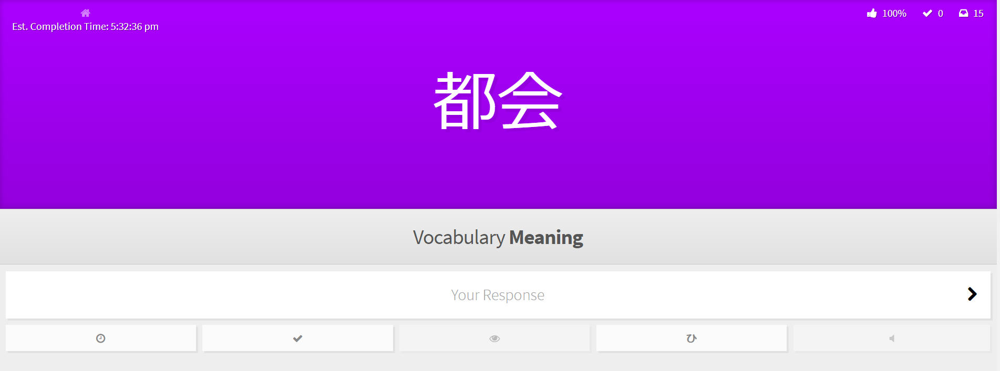
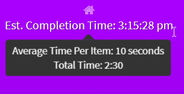

#### Summary

Simple UserScript for [Wanikani](https://www.wanikani.com/) that estimates the review completion time based on how quickly you answer items correctly.

#### How it Works

The script works by keeping a running time of your review session and dividing that by your completed item count to get an average. It then multiplies that average time by the number of remaining review items and adds that to the current time to give you a reasonable estimate of when you will be done.

#### Things to Keep in Mind

- Estimated time updates after every response
- Timer is paused when Wanikani tab is out of focus
- Leaving Wanikani idle will only end up increasing the timer by a maximum of 60 seconds after response (reduces inaccuracies caused by being idle)
- Initial estimate is based on average from previous review session, but otherwise is only based on current session
- Clicking on the display will toggle between estimated completion time and estimate time remaining

#### Links

- [Download/Install (Greasy Fork)](https://greasyfork.org/en/scripts/387651-wanikani-review-completion-estimate)
- [Wanikani Community Post](https://community.wanikani.com/t/userscript-wanikani-review-completion-estimate/37906)
- [My Other Projects](https://steven-kraft.com/projects/japanese/)

##### Update Log:
**v0.2**
  - Added alertnate display option when click on text
  - Fixed minor issue related to idle Timer
